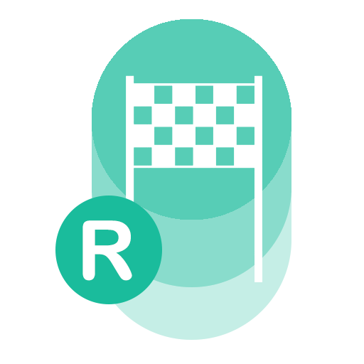

#  AGRallye

This is a simple app to display teams and their current points in fullscreen on a second monitor in a school-chalkboard-like style.

## Download
See [releases](https://github.com/hrueger/AGRallye/releases)
